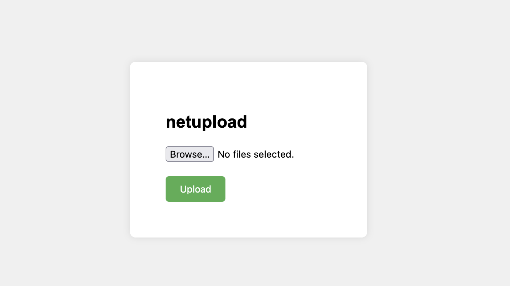

# netupload

Simple file upload server for when you need to send files around on your local network.

Sometimes you don't want to login to your email and don't have a USB so this can be a quick way to transfer files.



## Usage

```
pip install -U netupload
```

```
netupload
```

## Options

```
netupload --host=0.0.0.0 --port=4000 --save-dir=./uploads
```

| Option     | Description                      | Default   |
| ---------- | -------------------------------- | --------- |
| --host     | Host to run the server on        | 0.0.0.0   |
| --port     | Port to run the server on        | 4000      |
| --save-dir | Directory to save uploaded files | ./uploads |
